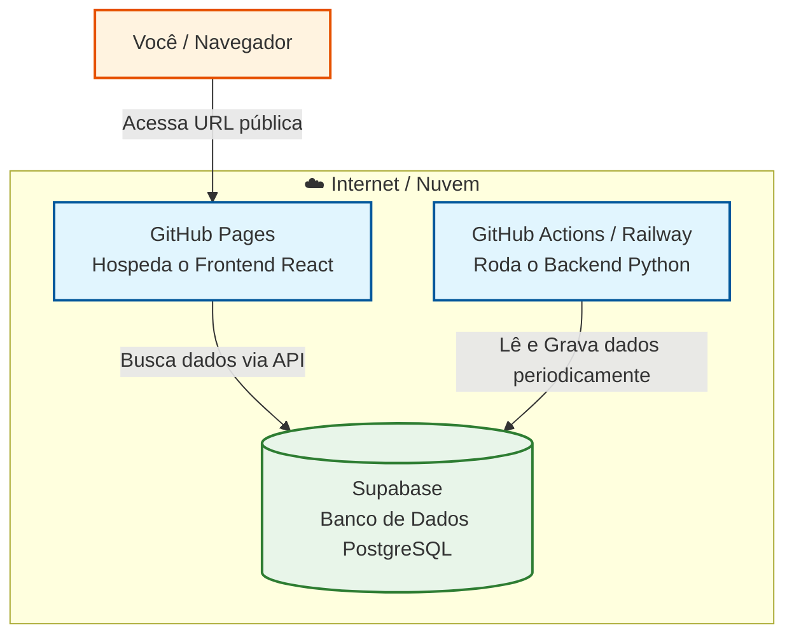
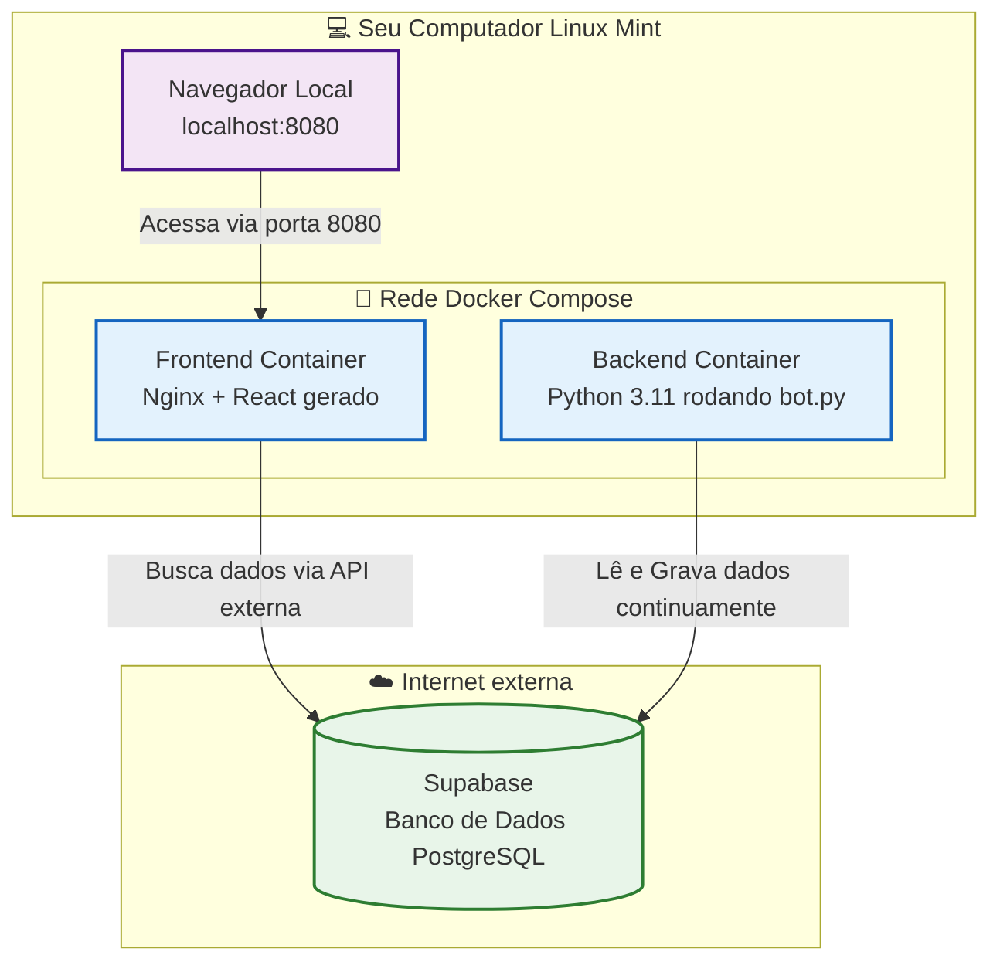

# Arquitetura: Nuvem (GitHub) vs Local (Docker)

Neste documento explicamos como o **Store Analytics Dashboard** funcionava originalmente na nuvem (usando os serviços do GitHub e Railway) em comparação com a nova versão local rodando 100% na sua máquina com **Docker Compose**.

---

## ☁️ 1. O Projeto Original (Nuvem)

No repositório original, o projeto estava "espalhado" por diferentes serviços gratuitos da internet. Funciona muito bem, mas você não tem controle total do ambiente de execução e depende da internet.

### Como funcionava:
- **Frontend (Painel):** O código React ficava no GitHub. Toda vez que você atualizava, o *GitHub Actions* construía o HTML/JS e publicava gratuitamente no **GitHub Pages**.
- **Backend (Bot Python):** Pelo README, o bot rodava no **Railway** (ou como um cronjob no GitHub Actions). Ele executava o script e morria ou ficava em segundo plano rodando a cada X minutos.
- **Banco de Dados:** Supabase (Cloud).

### Fluxograma Original (Nuvem)

---

## 🐳 2. O Projeto Atual (Local com Docker)

Agora, nós trouxemos **tudo** (exceto o banco de dados) para dentro da sua própria máquina Linux Mint, izolando as execuções dentro de "caixinhas" chamadas containers.

As vantagens:
- Não de depende de internet para rodar o backend.
- Não depende do limite de minutos gratuitos do GitHub Actions.
- Se você quiser mudar o frontend, você vê a alteração instantaneamente (`localhost`), sem precisar subir pro GitHub e esperar 2 minutos para atualizar.

### Como funciona agora:
- **Frontend (Painel):** Roda em um container com servidor **Nginx** na porta `8080` do seu computador.
- **Backend (Bot Python):** Roda em outro container, 24 horas por dia, executando o seu `bot.py` isolado do resto do sistema operacional (ele não sabe que está num Linux Mint, eleacha que é um Debian puro).
- **Banco de Dados:** Continua no Supabase. O Docker precisa apenas da conexão com a internet para as requisições (API) chegarem lá.
- **O Maestro (Orquestrador):** O `docker-compose.yml` une os dois containers e gerencia as reinicializações.

### Fluxograma Novo (Local Docker)

---

## 🔍 Principais Mudanças Técnicas

1. **Variáveis de Ambiente:** No GitHub, você salvava as chaves do Telegram/Supabase nos *Secrets* das configurações. No Docker, você salva essas mesmas chaves no arquivo `.env` na raiz do projeto (que nós forjamos hoje para o bot não dar erro).
2. **Build do Frontend:** O comando `npm run build` que o GitHub Actions fazia numa máquina deles, agora o Dockerfile faz dentro da sua máquina durante a execução do `docker compose build`.
3. **Isolamento de Erros:** Se o servidor Python der um erro e fechar (*Crash*), o `docker-compose.yml` tem a instrução `restart: always`, então ele automaticamente levanta o bot de novo sem você precisar fazer nada.
